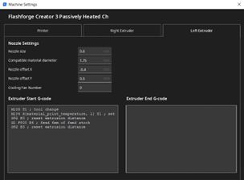

# Flashforgeowy Podręcznik Użytkownika

> Edycja 3
> by Michał Białoskórski

## Słowem wstępu

1. GŁOWICE, dwie, IDEX.
2. Tryb dupilcate i mirror jest teoretycznie możliwy, jednak nie planuję się nim zajmować, ze względu na dość duży z-gap między głowicami. Nie jest to po prostu praktyczne oraz jest NIEZALECANE używanie tych trybów ze względu na szkło na stole.
3. Obie głowice to 0.6 i nie, nie da się ich zmienić a przynajmniej nie bez kupienia specjalnie do flasha, co można rozważyć w przyszłości.
4. Profil składa się z 2 _drukarek_, ponieważ nie da się rozdzielić włączania i wyłączania tłoczenia powietrza do komory przez wiatraki z tyłu drukarki w inny sensowny sposób
5. Oryginalny niebieski stół z _tworzywa_ jest nierówny, ale działa i można go zamontować w razie potrzeby. Zamiast niego zostało zamontowane szkło.
6. Klipsy mocujące szkło zmniejszają pole robocze wydruku. Jest to zaznaczone w slicerze
7. Używaj opcji preheatu, bo grzanie stołu może trwać nawet kilkanaście minut, zwłaszcza dla ABS i innych wymagających materiałów.
8. Profil wspiera wyłącznie Curę i nie ma planów tworzenia wersji dla innych slicerów.
9. ABSOLUTNIE NIGDY NIE WOLNO WYŁĄCZAĆ CHŁODZENIA W SLICERZE. REGULACJA WYŁĄCZNIE MANUALNA - WAJCHĄ NA GŁOWICY

## Filament

1. Ta wersja Profilu wspiera PLA, PETG, ABS, PC, i ASA bez żadnych modyfikacji.
2. Druk z gumy jest możliwy po korektach, przykładowy gcode z sugerowanymi wartościami załączyłem w folderze `gcodes`
3. Czujnik filamentu znajduje się na początku rurki PTFE (czyli od strony szpuli)
4. Flash to direct, ale w rurkę ptfe trzeba filament wkładać i wyciągać ręcznie przed drukowaniem
5. Ładowanie filamentu wykrywa obecność filamentu w czujniku, więc należy najpierw wepchnąć ok 3-4 cm filamentu i dopiero wtedy drukarka pozwoli włączyć wciąganie filamentu
6. Wyciąganie filamentu jest ślepe. Kręci ekstruderem do tyłu i gdy już wyciągnie filament z głowicy, trzeba ręcznie go nawinąć na szpulę
7. UWAGA: Flash nie wykrywa jak długo ładuje/rozładowuje filment. NIE WOLNO zapomnieć, że pracuje, bo albo będzie wam zjadał szpulę albo uszkadzał sobie radełko
8. UWAGA: Czasem filament nie wchodzi w hotend tylko wyłazi bokiem, zawsze należy zwracać uwagę czy filament wszedł prawidłowo
9. Sprężyna dociskająca ekstruder, jest zamontowana na drukowanym elemencie, jeśli występuje problem z underextrudowaniem to znaczy, że docisk ekstrudera odkształcił się pod wpływem temperatury i należy wydrukować nowy i go wymienić
10. Docisk ekstrudera drukuje się z ASA, 5 obrysów, 30% infilu, 8 warstw top/bottom
11. Jeśli szpula jest zbyt szeroka, jest wydrukowane rozszerzenie, oraz w zipie z plikami znajduje się model, jeśli zajdzie potrzeba dodrukowania. Zalecany materiał: ABS

## Stół

1. Flash nie prusa, stołu nie zdejmujemy, ponieważ odłożenie go tak samo jest właściwie niemożliwe i wymaga każdorazowej kalibracji osi z
2. Przed kalibracją należy upewnić się, że stół jest czysty a pod spodem nie ma żadnych zanieczyszczeń
3. Klej to wasz przyjaciel, przed wydrukiem lekko posmarujcie obszar, na którym będzie się coś drukować, zwłaszcza przy pracy z ABS i innymi materiałami o niskiej adhezji
4. Flash ma czujnik optyczny dla osi z a to oznacza, że śmieci na dole komory mogą powodować problemy, więc zabierz od razu to, co ci spadło
5. Ze względu na szkło obowiązują standardowe zasady pracy z drukarką ze szklanym stołem, nie są one przedmiotem tego poradnika, więc jeśli nigdy nie drukowałeś/aś na szkle zapytaj innego doświadczonego współkołowicza/kę.
6. Szkło dokręcone jest klipsami z pc-pbt. Jest to rozwiązanie nieidealne i w przyszłości optymalnie należałoby opracować coś lepszego.
7. Klipsy uniemożliwiają drukowanie na pierwszych 5cm od strony drzwiczek, co jest oznaczone na modelu w slicerze.
8. Poziomowanie stołu odbywa się z poziomu drukarki i ma dwa etapy, Pierwszy tak naprawdę służy do regulacji pokręteł z przodu, drugi ustala prawidłową odległość stołu od obu głowic.
9. UWGA ZAWSZE, ALE TO ZAWSZE należy wykonać oba etapy, drukarka oferuje zakończenie poziomowania po pierwszym etapie, ale nie wolno się na to zgodzić. Wyrażenie zgody grozi zbiciem szkła oraz może zepsuć kalibrację z-gappu między głowicami.
10. Przy poziomowaniu należy użyć kartki. Prawidłowa odległość to taka, w której kartka rusza się zarówno podczas ciągnięcia i pchania ale stawia wyczuwalny opór pod naciskiem głowicy.

## Chłodzenie

1. Flash ma zainstalowany customowy mod do chłodzenia, pozwalający na kontrolę chłodzenia wydruku.
2. Wszystkie modele moda znajdują się na nerdowni oraz w zipie ze wszystkimi plikami Flasha
3. Chłodzenie można ustawić w 3 pozycjach:

   a. Pełne chłodzenie – ramię włożone aż do zapadki
   
   b. Chłodzenie częściowe – ramię pomiędzy zapadkami
   
   c. Chłodzenie odcięte – ramię wyciągnięte aż do zapadki
   

4. Cały mod drukowany jest z ASA, ale to nie znaczy, że jest niezniszczalny, szczególnie delikatne jest ramię, które należy przesuwać bardzo ostrożnie, by go nie złamać.
5. Przy demontażu osłony ekstrudera, należy przełożyć ramię w pozycję pełnego chłodzenia i dopiero wtedy odchylić osłonę ekstrudera, delikatnie wciskając ramię do środka
6. Przy montażu należy zwrócić uwagę na wystające ramię i delikatnie przepychać je tak długo aż wyjdzie w 3 od dołu otworze radiatora DOKŁADNIE w tym miejscu, co na zdjęciu
7. Mod musi być odbity lustrzanie odpowiednio dla lewej i prawej głowicy, należy na to zwrócić uwagę podczas przygotowywania modelu do druku

## Druk dwugłowicowy

1. Obowiązują standardowe procedury, jeśli chodzi o druk wielogłowicowy w curze
2. Należy zawsze włączyć prime tower i ustawić ją możliwe blisko wydruku
3. Głowica prawa to extruder 1, głowica lewa to extruder 2 patrząc od strony drzwiczek.
4. Flashforge ma offset w osi x i y głowic, na chwilę pisania tego poradnika extruder 2 ma x=0,4 y=-0,5.
5. UWAGA offset wpisywany w curze to pozycja w jakiej RZECZYWIŚCIE JEST głowica względem pozycji [0,0] a cura następnie ustawia przesunięcie tak by wynikowy offset był zerowy.
   Czyli, dla wartości z pkt 4 należy w curze ustawić x=-0,4 y=0,5, ale jeśli wyliczysz przesunięcie z gcodu to wyjdzie ci x=0,4 y=-0,5
6. W przypadku zmiany głowic, ich odkręcania lub zakręcania należy sprawdzić czy offset jest prawidłowy, dołączam model do kalibracji w folderze z modelami

## Druk kolorowy, w stylu Prusy mini

1. Flashforge używa instrukcji M25 do zatrzymania wydruku w dowolnym momencie
2. Przy zapauzowaniu, drukarka utrzymuje temperaturę stołu i ekstrudera
3. Wykorzystując powyższe informacje można ręcznie wpisać w gcode odpowiednią instrukcję, a potem manualnie wymienić filament, co pozwala na uzyskanie warstw różnego koloru
4. UWAGA Odradza się pozostawiania drukarki w zastopowanym stanie na noc, należy więc planować czas wydruku w oparciu o własny wolny czas lub dostępność osób w labie

## Wiedza tajemna

To jedyna sekcja, którą można pominąć. Jest ona wyłącznie istotna dla ciekawskich lub kogoś, kto chciałby zrobić aktualizację profilu

1. Ograniczenie pola roboczego stołu wynika z faktu, że klipsy wystają, ich zmiana zlikwiduje ten problem
2. Flash stopuje wydruk, jeśli dostanie temperaturę jako liczbę niecałkowitą, skrypt usuwa liczby po przecinku w każdej instrukcji dotyczącej temperatury co łata problem
3. W folderze flash-double znajdują się 3 gcody. To slice przy użyciu flashprinta – natywnego slicera dla flashforga w trybie duplicate, mirror i normalnym. Obiekt do slicowania za każdym razem był idealnie na środku stołu, więc parę ciekawych rzeczy można z tego wywnioskować. Obserwacje możesz przeczytać w komentarzach w liniach 26-47 w pliku `infilTestHolderUpDUPLICATE`
4. W folderze `gcodes\modele-flashforge` znajdują się wszystkie modele, które kiedykolwiek wykonałem dla tej drukarki. Są też na nerdowni ale dla pewności wyeksportowałem f3d i 3mf. 3mf jest wyeksportowane pod druk, więc niektóre modele są w częściach.
5. Flashforge ma czujnik otwarcia drzwi, jest on w drzwiczkach. Został jednak zaklejony dla wygody użytkownika czarną taśmą izolacyjną.
6. Środek stołu drukarki jest w jego środku, ma to znaczenie bo inaczej wydruki będą przesunięte i najprawdopodobniej popsute.
7. Szybszą metoda na ładowanie filamentu jest wyłącznie nagrzanie głowicy, odchylenie docisku filamentu i ręczne wpuszczenie filamentu w extruder, wymaga to jednak trochę wyczucia.
8. Podczas druku ikona w prawym dolnym rogu otwiera menu kontekstowe. Są tam dwie ciekawe opcje: `Filament` – która po zapauzowaniu pozwala zmienić filament oraz `Details` – w której można zmienić Z offset w czasie rzeczywistym oraz przyspieszyć druk

## Profil

### Instalacja

1. Poradnik zakłada, że najpierw zainstalowano Curę, ale jej NIE URUCHOMIONO
2. Zawartość folderów `definitions`, `extruders` i `scripts` z `Cura - foldery` przekopiować do odpowiednich folderów w `C:\Users\[konto]\AppData\Roaming\cura\5.2.1\`
3. Do folderu `C:\Program Files\Ultimaker Cura 5.2.1\share\cura\resources\meshes\` należy wrzucić plik 3mf z folderu meshes
4. Po otworzeniu, cury powita cię okno startowe, a następnie licencyjne, gdzie musisz wyrazić zgodę na licencję programu oraz pominąć tworzenie konta

   
   
   

5. Teraz dodaj pierwszą z 2 instancji drukarki, wybierz _non Ultimaker printer_, następnie _non-networked printer_ i na liście znajdź zakładkę _flashforge_ i zaznacz _Flashforge creator 3_

   
   
   

6. Drukarka powinna się dodać wraz z napisem na stole, teraz przełącz tryb ustawień na _custom_.

   

7. Rozwiń listę profili na górze, i otwórz menadżera profili

   

8. Wybierz opcję import i z folderu `Cura - foldery` wybierz plik `FFC3 02mm DUAL DEFAULT`, następnie _Ok_ i z menu z prawej _printers_

   

9. Kliknij _Add new_ a następnie tak jak wcześniej dodaj drukarkę, tym razem jednak jej druga wersję – _Flashforge Creatr 3 Passively Heated Chamber_

   
   

10. Zamknij wszystkie okna, z głównego okna slicera, wybierz panel drukarek i upewnij się że obie instancje prawidłowo się dodały i kliknij Manage printers

    

11. Kliknij Machine settings i upewnij się że dane w zakładkach się pokrywają

    
    
    
    

12. Przełącz drukarkę i powtórz krok 11

## Użytkowanie

1. Profil DUAL DEFAULT jest bardzo dobry i jeśli nie wiesz co robisz, odradzam zmianę ustawień poza infilem i supportami

   

2. Profil DUAL DEFAULT jest bardzo dobry i jeśli nie wiesz co robisz, odradzam zmianę ustawień poza infilem i supportami

   
   

3. W zależności, czym chce się drukować należy oczywiście wybrać również odpowiednią _drukarkę_ (komora grzana lub nie). Nie da się tego zrobić inaczej ze względu na charakterystykę cury i flasha

Powodzenia
